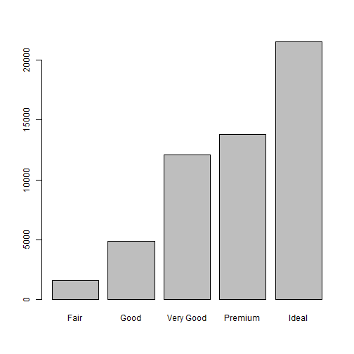
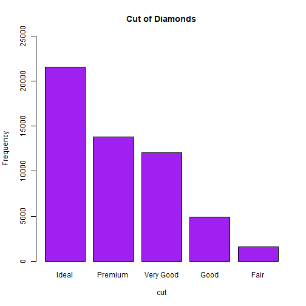
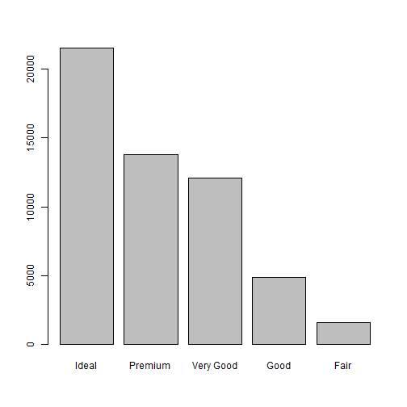
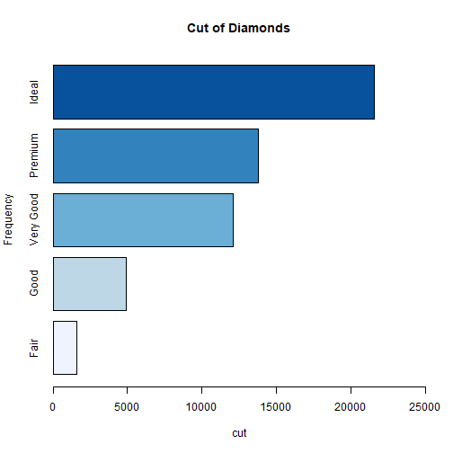

> ebuil YouTube(https://www.youtube.com/channel/UCJ49UIzNXAaxZdDNYFxNhsA/featured) study

***
-- 2019. 7. 31. 

***

### base::barplot

  - 일변량 질적 자료 분석을 위한 barplot
  - using 'ggplot2::diamonds' DataSet


```r
head(diamonds, 3)
```

```
## # A tibble: 3 x 10
##   carat cut     color clarity depth table price     x     y     z
##   <dbl> <ord>   <ord> <ord>   <dbl> <dbl> <int> <dbl> <dbl> <dbl>
## 1  0.23 Ideal   E     SI2      61.5    55   326  3.95  3.98  2.43
## 2  0.21 Premium E     SI1      59.8    61   326  3.89  3.84  2.31
## 3  0.23 Good    E     VS1      56.9    65   327  4.05  4.07  2.31
```

```r
table(diamonds$cut)
```

```
## 
##      Fair      Good Very Good   Premium     Ideal 
##      1610      4906     12082     13791     21551
```


```r
barplot(table(diamonds$cut))  # 빈도 확인 
```



  - 내림차순 sort/decreasing

```r
barplot(sort(table(diamonds$cut), decreasing = T))
```


  
### barplot arguments
  
    - col   = "color"         막대의 색깔
    - main  = "title"         차트 제목
    - ylab  = "y axis name"   y축 라벨
    - xlab  = "x axis name"   x축 라벨 
    - ylim  = c(min, max)     y축의 범위
    - horiz = TRUE            축 방향 설정 


```r
barplot(sort(table(diamonds$cut), decreasing = T), 
        col = "purple", 
        main = "Cut of Diamonds", 
        ylab = "Frequency", 
        xlab = "cut", 
        ylim = c(0, 25000))
```



  - RColorBrewer 를 이용한 다양한 색깔이용

```r
library(RColorBrewer)
display.brewer.all(type = "seq")
```


```r
color.palette <- RColorBrewer::brewer.pal(n = 5, name = "Blues")

barplot(sort(table(diamonds$cut), decreasing = T), 
        col  = sort(color.palette, decreasing = F), 
        main = "Cut of Diamonds", 
        ylab = "Frequency", 
        xlab = "cut", 
        ylim = c(0, 25000))
```


  
  - horiz = TRUE  막대의 방향 변경

```r
barplot(sort(table(diamonds$cut), decreasing = F), 
        col   = sort(color.palette, decreasing = T),
        main  = "Cut of Diamonds", 
        ylab  = "Frequency", 
        xlab  = "cut", 
        xlim  = c(0, 25000),       # horiz에 맞추어 변경 
        horiz = TRUE)
```


  
  
